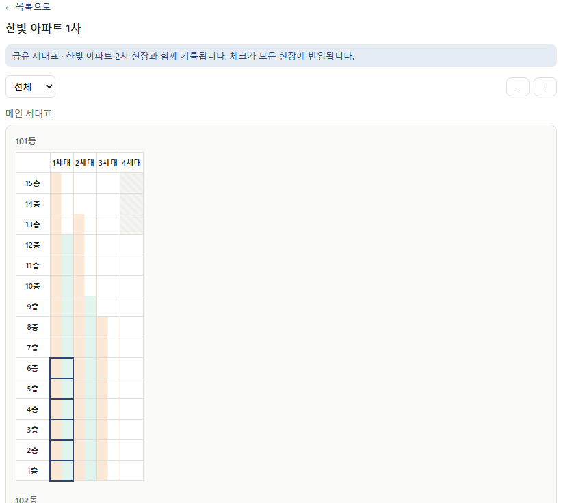
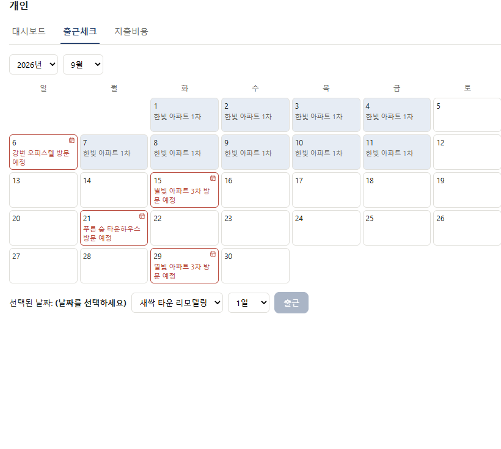
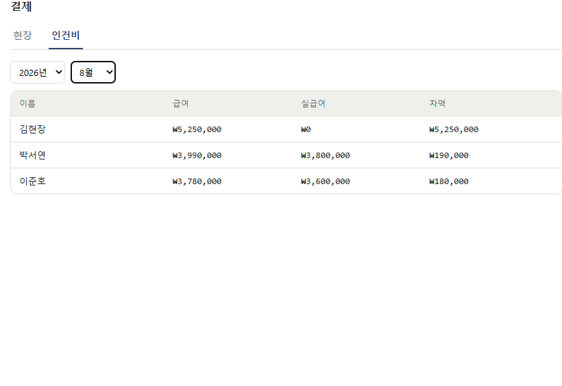
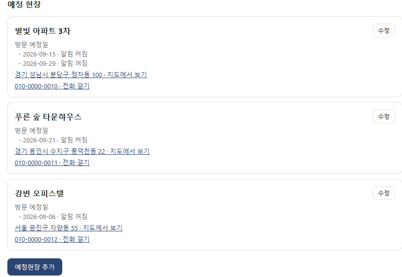

# 현장 관리 앱

여러 건설 현장의 작업 진행률·인력·정산을 통합 관리하는 PWA입니다.

> 이 저장소는 포트폴리오 공개용 사본입니다. 실제 운영 데이터는 담겨 있지 않고,
> 데모 사이트는 운영과 분리된 별도 Supabase·Cloudflare 프로젝트에 예시 데이터로 채워져 있습니다.

## 데모

- **배포 주소**: https://integrated-construction-site-management-app-portfolio.skditjdqja.workers.dev
- **테스트 계정**: `test@test.com` / `test1234!@#$` (팀장 권한)

회원가입은 막혀 있습니다. 위 계정으로 로그인해 둘러보세요.

## 스크린샷

| 세대표 | 출근 체크 |
|---|---|
|  |  |

| 인건비 정산 | 예정 현장 |
|---|---|
|  |  |

## 핵심 기능

**세대표** — 동·라인별 층수가 제각각인 아파트 구조를 그리드로 표현합니다. 경량/합지 작업을 한 칸의 좌우 절반씩 칠해, 어느 세대가 어디까지 진행됐는지 한 화면에서 읽힙니다.

**여러 현장이 세대표 하나를 공유** — 같은 아파트 2차·3차처럼 도면이 같은 현장은 세대표를 함께 씁니다. 모양만 복사하는 게 아니라 경량·합지·석고 시공·미타공 기록이 같은 데이터라, 어느 현장에서 체크해도 양쪽에 반영됩니다. 공유 중이라는 사실은 배너와 배지로 항상 보이게 했습니다.

**권한 3단계** — 팀원·팀장·개발자. 메뉴 노출 제어와 DB단 RLS로 이중 방어합니다.

**정산 자동화** — 출근 기록 × 단가로 급여를 산출하고 실지급액과의 차액을 관리합니다.

**오프라인 지원** — 세대표를 캐시해 오프라인에서도 열람할 수 있고, 출근체크·지출·세대표 편집은 큐에 쌓아뒀다가 온라인이 되면 순서대로 전송합니다. 현장은 통신이 불안정한 곳이 많습니다.

**작업 로그** — 모든 체크·취소·처리 이력을 시각·처리자와 함께 기록합니다.

## 기술 스택

| 영역 | 선택 | 이유 |
|---|---|---|
| 프론트 | React + Vite | 빠른 빌드, PWA 플러그인 생태계 |
| 배포 형태 | PWA | 앱스토어 심사 없이 안드로이드·iOS 동시 지원, 배포 비용 0원 |
| DB/인증 | Supabase | 관계형 데이터 구조에 적합, RLS로 권한을 DB단에서 강제 |
| 호스팅 | Cloudflare Workers | 정적 자산 배포 무료 제공량이 넉넉하고 상업적 이용 허용 |
| 스타일 | 순수 CSS | 의존성 없이 토큰 기반으로 관리 |

## 설계 결정

**왜 네이티브 앱이 아니라 PWA인가**

사내 소수 인원용 도구라 스토어 배포가 불필요했고, 새 버전 배포도 빌드 후 한 번의 배포로 끝나 별도 업데이트 절차가 없습니다.

**왜 Firebase가 아니라 Supabase인가**

현장→동→세대, 인원→출근→정산처럼 참조 관계가 많은 데이터라 관계형 DB가 맞았습니다. NoSQL이었다면 "이 현장 인원의 이번 달 출근일수" 같은 조회를 위해 데이터를 여러 곳에 복제해야 했을 겁니다.

**권한을 프론트에서만 막지 않은 이유**

메뉴를 숨기는 건 UI 편의일 뿐 보안이 아닙니다. Postgres RLS로 DB 레벨에서 강제해, API를 직접 호출해도 권한 밖 데이터는 반환되지 않습니다.

**세대표 공유를 다대다 테이블로 만들지 않은 이유**

체크·미타공·로그가 전부 `building_id`로 저장되므로, 여러 현장이 같은 `buildings` 행을 보게만 하면 데이터는 자연히 공유됩니다. 동을 현장에서 떼어내는 큰 스키마 변경 대신 `sites.sheet_source_id` 한 컬럼으로 해결했고, 값이 `null`이면 기존 동작 그대로라 이미 있는 현장은 영향을 받지 않았습니다. 참조가 사슬처럼 이어지면 세대표를 어디서 찾을지 정할 수 없어, 트리거로 "원본 1 : 참조 N" 한 단계만 허용합니다.

## 프로젝트 구조

```
src/
  api/         Supabase 쿼리 (기능별로 분리)
  components/  공용 컴포넌트
  pages/       화면 (개인·현장관리·결제·인사관리·예정현장·설정)
  lib/         Supabase 클라이언트, 오프라인 큐, IndexedDB
supabase/
  migrations/  스키마 변경 이력
docs/
  현장관리어플_기능데모.html   기능 명세이자 UI 설계도
```

## 로컬 실행

```bash
npm install
cp .env.example .env   # Supabase 값 입력
npm run dev
```

`supabase/migrations/`의 SQL을 순서대로 실행하면 스키마가 그대로 재현됩니다.

## 원본과 동기화 (사본 관리용)

원본 저장소의 변경분을 가져오고, 공개해도 안전한 상태인지 검증합니다.

```bash
./scripts/sync-from-source.sh [원본_저장소_경로]
```

`VITE_` 환경변수는 빌드 시점에 번들로 박히기 때문에, `.env`를 커밋하지 않는 것만으로는
운영 키 노출을 막을 수 없습니다. 그래서 이 스크립트는 빌드 전에 `.env`가 데모 프로젝트를
가리키는지 확인하고, 빌드 후에도 번들에 다른 프로젝트 주소나 secret 키가 섞이지 않았는지
다시 확인합니다. 하나라도 어긋나면 종료 코드 1로 중단합니다.

## 배포

`main`에 푸시하면 Cloudflare Workers Builds가 빌드해서 데모 사이트에 반영합니다.
별도로 `wrangler deploy`를 실행할 필요는 없습니다.

빌드에 쓰는 Supabase 값은 `.env.production`에 들어 있습니다. 데모 전용 프로젝트의 URL과
publishable 키라 이미 공개된 번들에 드러나는 값이고, 저장소에 고정해두면 어디서 빌드하든
항상 데모 프로젝트를 가리킵니다. Vite가 `.env.production`을 `.env`보다 우선 적용하므로
로컬에 운영 `.env`가 잘못 들어와 있어도 운영 키가 공개 번들에 실리지 않습니다.

## 변경 기록

[CHANGELOG.md](CHANGELOG.md) 참고.
